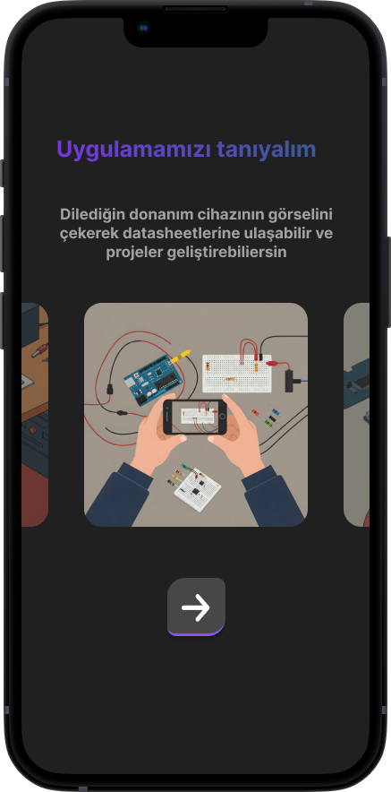
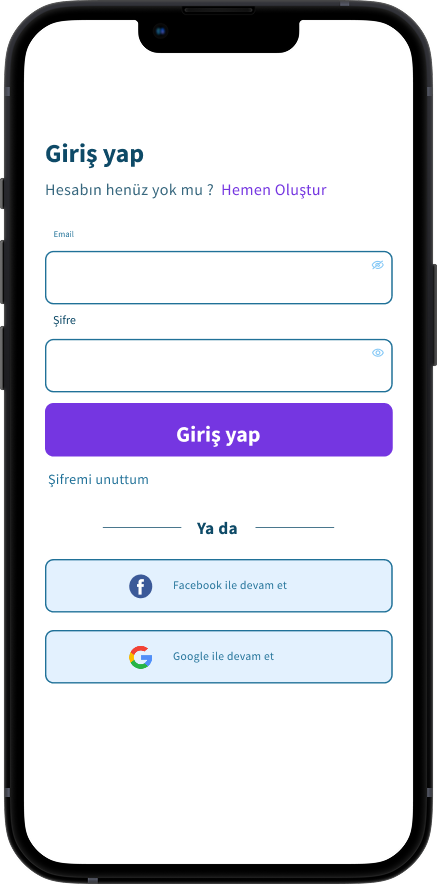
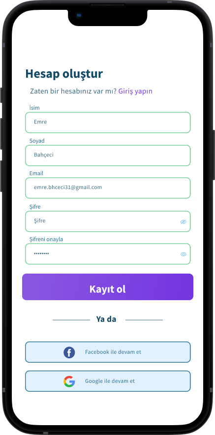
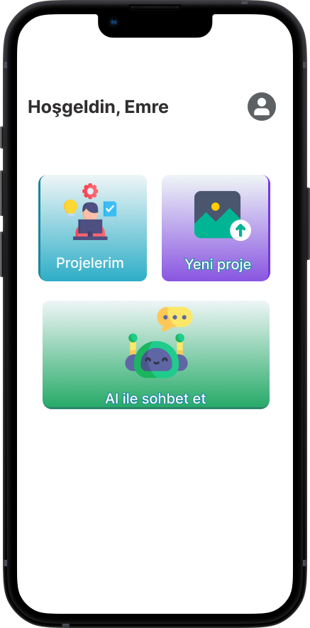
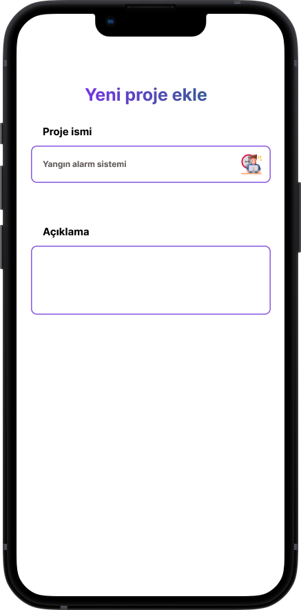
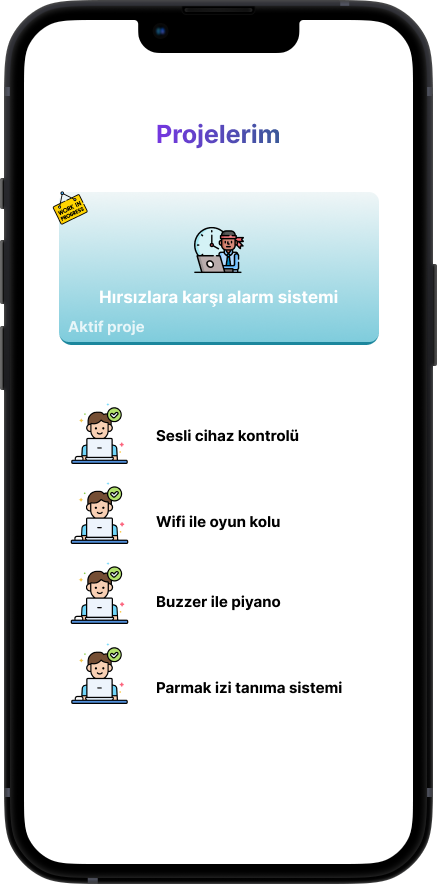
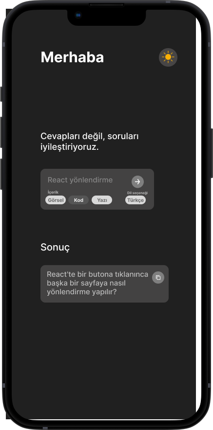
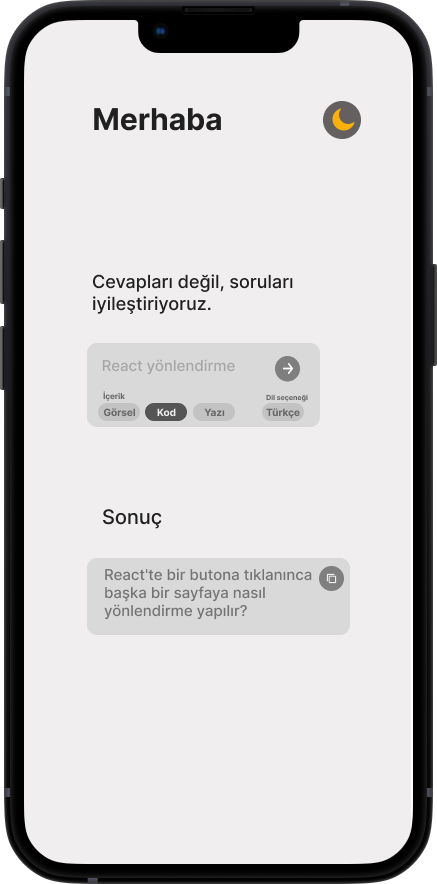

# Mobil

**Circuit recegnition**, mevcut donanım cihazlarının görsel üzerinden yapay zeka aracılığı ile tanımlanması ve cihazlara göre proje önerilmesi sistemi.

---

## 🚀 Amaçlar

- Mevcut cihazlarının görsel üzerinden yapay zeka ile belirlenmesi.
- Tespit edilen cihazlara göre proje önerme sistemi.
- Önerilen projelerin detayının gösterilmesi
- Projelerin içerisinden tercih edilenin isim ve açıklaması ile kaydedilmesi ve projelerim sayfasında gösterilmesi.   

---

## 🛠 Kullanılan Teknolojiler

- **Mobil Uygulama Geliştirme**: [Flutter](https://flutter.dev/)
- **Yapay zeka API sistemi**: [OpenRouter](https://openrouter.ai/)
- **Veri Tabanı**: [Firebase Firestore](https://firebase.google.com/docs/firestore)

 
  
  
  
  
  
  
  
  

 

**AI prompt oluşturucu**, kullanıcıların cevaplarına değil sorularına yardımcı olabilmek

---

## 🚀 Amaçlar

- Kullanıcının güzel cevaplar alabilmesi için prompt girdilileri alınır.
- Yapay zeka ile prompt istenen amaca en uygun olacak şekilde güncellenerek kullanıcıya sonuç olarak verilir.
   

---

## 🛠 Kullanılan Teknolojiler

- **Mobil Uygulama Geliştirme**: [Flutter](https://flutter.dev/)
- **Yapay zeka API sistemi**: [OpenRouter](https://openrouter.ai/)

 
  
  
  

 

